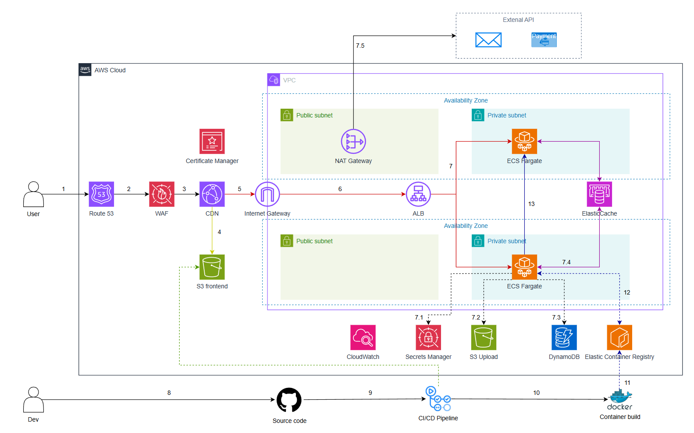
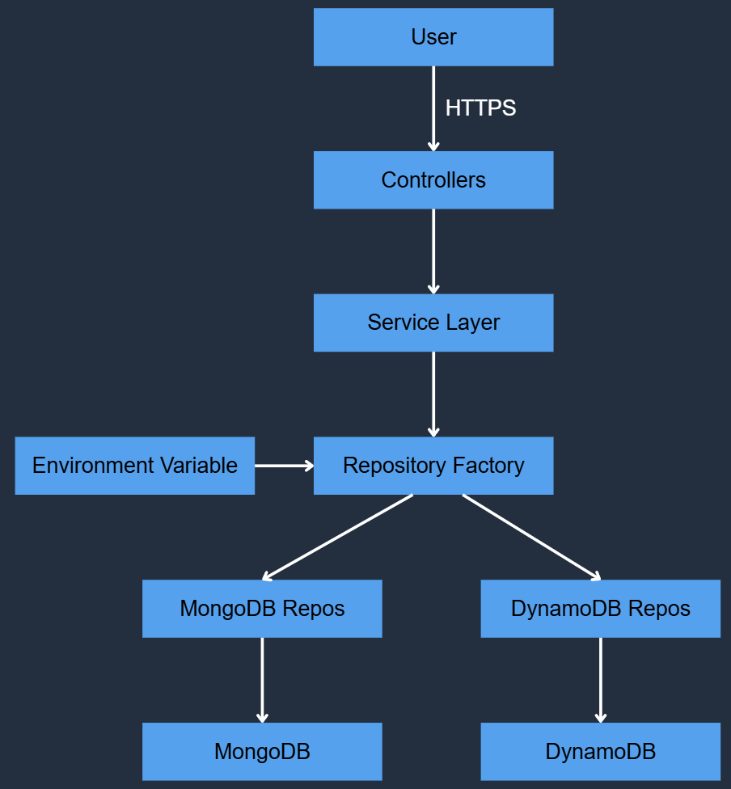

# 🛍️ HỆ THỐNG QUẢN LÝ SÁCH TRỰC TUYẾN

## 📋 TỔNG QUAN

Ứng dụng web full-stack cho hệ thống quản lý và bán sách trực tuyến với kiến trúc production-ready trên AWS.

### 🏗️ Kiến Trúc Production
- **Frontend**: React.js + Tailwind CSS → S3 + CloudFront (CDN global)
- **Backend**: Node.js + Express.js → ECS Fargate (Auto-scaling 1-4 tasks), Lambda (resize image)
- **WebSocket**: Real-time notifications → ALB (Sticky Sessions)
- **Database**: AWS DynamoDB (Single-Table Design, On-Demand)
- **Cache**: AWS ElastiCache Redis (Sessions, API cache)
- **Storage**: AWS S3 (Uploads, Static files)
- **Infrastructure**: Terraform (Infrastructure as Code)



### 📚 Tài Liệu


---

## 🏗️ KIẾN TRÚC HỆ THỐNG

### Backend Architecture (Clean Architecture)



```
┌─────────────────────────────────────────┐
│         Controllers Layer               │
│  (HTTP Request/Response Handling)       │
└──────────────┬──────────────────────────┘
               │
┌──────────────▼──────────────────────────┐
│         Services Layer                  │
│  (Business Logic & Validation)          │
└──────────────┬──────────────────────────┘
               │
┌──────────────▼──────────────────────────┐
│      Repository Pattern                 │
│  (Database Abstraction Interface)       │
└──────────────┬──────────────────────────┘
               │
               ▼
        ┌─────────────┐
        │  DynamoDB   │ ◄──── Production Database
        │ Repository  │
        └──────┬──────┘
               │
        ┌──────▼──────┐
        │  DynamoDB   │
        │   + GSI1    │
        │   + GSI2    │
        └─────────────┘
               │
        ┌──────▼──────┐
        │ CloudFront  │ ◄──── CDN for Images
        │     CDN     │
        └─────────────┘
```

### Infrastructure Routing Logic
- **Frontend (`/*`)**: CloudFront -> S3 Bucket (Static Files)
- **Backend (`/api/*`)**: CloudFront -> ALB -> ECS Fargate (API)
- **Lợi ích**: Chung domain (không CORS), bảo mật cao (Backend ẩn sau CDN).

---

<!-- ## 🧠 QUYẾT ĐỊNH KIẾN TRÚC (INFRASTRUCTURE DECISIONS)

### 1. Tại sao Backend dùng Docker (ECS Fargate)?
- **Môi trường đồng nhất**: Đảm bảo code chạy trên server giống hệt trên máy local.
- **Bảo mật**: Chạy với non-root user, hạn chế quyền truy cập hệ thống.
- **Graceful Shutdown**: Xử lý tín hiệu tắt an toàn, không làm rớt request.
- **Tối ưu**: Multi-stage build giảm kích thước image (<200MB).

### 2. Tại sao Frontend KHÔNG dùng Docker?
- **Chi phí**: Hosting file tĩnh trên S3 + CloudFront rẻ hơn nhiều so với chạy container 24/7 
- **Hiệu năng**: CloudFront cache nội dung tại edge location, tốc độ tải trang cực nhanh.
- **Scalability**: S3 không giới hạn băng thông và storage, không lo sập khi traffic tăng đột biến.

### 3. Mô hình CloudFront Single Distribution
Chúng tôi sử dụng **một** CloudFront distribution duy nhất cho cả Frontend và Backend:
- `example.com/*` -> Trỏ về **S3 Bucket** (Frontend React App)
- `example.com/api/*` -> Trỏ về **ALB** (Backend API)

**Lợi ích:**
- ✅ **Chung Domain**: Loại bỏ hoàn toàn lỗi CORS.
- ✅ **SSL/TLS**: Quản lý chứng chỉ tập trung tại CloudFront.
- ✅ **Bảo mật**: Backend ẩn sau CloudFront, không public trực tiếp ra internet. -->

---

## 📁 CẤU TRÚC THỨ MỤC

### Backend Structure
```
backend/
├── config/           # Cấu hình AWS, DynamoDB, JWT, environment
├── controllers/      # Xử lý HTTP requests
├── services/         # Business logic layer
├── repositories/     # Database abstraction
│   ├── interfaces/   # Repository interfaces
│   └── dynamodb/     # DynamoDB implementation (ACTIVE)
├── routes/           # API endpoints
├── middlewares/      # Authentication, error handling
├── utils/            # Helper functions (s3Upload, apiFeatures)
├── scripts/          # Utility scripts (create-table, seed-data)
└── tests/            # Test suites
    ├── unit/
    ├── integration/
    └── performance/
```

### Frontend Structure
```
frontend/
├── public/           # Static assets
└── src/
    ├── components/   # React components
    │   ├── layout/   # Layout components
    │   ├── product/  # Product components
    │   └── user/     # User components
    ├── pages/        # Page components
    ├── utils/        # Helper functions
    └── App.js        # Main app component
```

---

## 🔑 TÍNH NĂNG CHÍNH

### 1. Quản lý Sản phẩm (Products)
- ✅ CRUD operations cho sách
- ✅ Tìm kiếm tiếng Việt thông minh (có dấu & không dấu)
- ✅ Autocomplete với gợi ý sản phẩm
- ✅ Lọc theo giá, danh mục, đánh giá
- ✅ Sắp xếp theo giá (tăng/giảm dần)
- ✅ Phân trang
- ✅ Upload và quản lý hình ảnh (S3 + CloudFront)
- ✅ Quản lý tồn kho
- ✅ Đánh giá và review sản phẩm
- ✅ Hệ thống đề xuất sản phẩm
- ✅ Cache API

### 2. Quản lý Người dùng (Users)
- ✅ Đăng ký và đăng nhập
- ✅ Đăng nhập với Google OAuth 2.0
- ✅ JWT authentication
- ✅ Phân quyền (User/Admin)
- ✅ Quản lý profile
- ✅ Đổi mật khẩu
- ✅ Quên mật khẩu (email reset)

### 3. Quản lý Đơn hàng (Orders)
- ✅ Tạo đơn hàng
- ✅ Theo dõi trạng thái đơn hàng
- ✅ Lịch sử đơn hàng
- ✅ Quản lý thanh toán
- ✅ Cập nhật trạng thái giao hàng

### 4. Quản lý Danh mục (Categories)
- ✅ CRUD operations
- ✅ Phân loại sách theo thể loại
- ✅ Lọc sản phẩm theo danh mục

### 5. Giỏ hàng (Cart)
- ✅ Thêm/xóa sản phẩm
- ✅ Cập nhật số lượng
- ✅ Tính toán tổng tiền
- ✅ Áp dụng mã giảm giá
- ✅ Tự động xóa giỏ hàng sau khi đặt hàng thành công

### 6. Thông báo Real-time (WebSocket)
- ✅ Thông báo đơn hàng mới
- ✅ Cập nhật trạng thái đơn hàng
- ✅ Thông báo giao hàng thành công
- ✅ Icon chuông với badge số lượng
- ✅ Dropdown hiển thị lịch sử thông báo

---

## 🚀 HIỆU SUẤT & TESTING

### Performance Benchmarks
```
Response Time Standards:
- Excellent: < 100ms
- Good: 100-300ms
- Fair: 300-500ms
- Poor: > 500ms
```

### Test Coverage
- **Total Tests**: 185 passing
- **Code Coverage**: 85.47%
- **Test Types**:
  - Unit Tests
  - Integration Tests
  - Performance Tests
  - Stress Tests

### Performance Testing Tools
```bash
npm run test:performance  # Chạy performance tests
npm run perf:report      # Tạo báo cáo chi tiết
npm run perf:stress      # Stress testing
npm run perf:baseline    # Tạo baseline
npm run perf:compare     # So sánh với baseline
```

---

## 💾 DATABASE DESIGN

### DynamoDB (Production)

**Single-Table Design với 2 GSIs:**

```
Table: BookStore
Primary Key: PK + SK
GSI1: GSI1PK + GSI1SK (Category, Email, User relationships)
GSI2: GSI2PK + GSI2SK (Status, Price, Stock filtering)
```

**Entity Types:**
- Products: `PK=PRODUCT#<id>`, `SK=METADATA`
- Reviews: `PK=PRODUCT#<id>`, `SK=REVIEW#<userId>`
- Users: `PK=USER#<id>`, `SK=METADATA`
- Orders: `PK=ORDER#<id>`, `SK=METADATA`
- Order Items: `PK=ORDER#<id>`, `SK=ITEM#<productId>`
- Categories: `PK=CATEGORY#<id>`, `SK=METADATA`

**Access Patterns được hỗ trợ (23 patterns):**
- Get product by ID (~10ms)
- List products by category (~50ms)
- Search products by keyword
- Filter by price range
- Get user orders (~30ms)
- Get order details
- List reviews by product
- ... và nhiều patterns khác

**Kết quả đạt được sau migration:**
- ✅ Cải thiện 75-85% hiệu suất đọc
- ✅ Auto-scaling tự động
- ✅ Chi phí thực tế: ~$12/month (giảm 73% so với MongoDB)
- ✅ Zero downtime migration
- ✅ CloudFront CDN integration

---

## 🔐 BẢO MẬT

### Implemented Security Features
- ✅ JWT Authentication
- ✅ Password hashing (bcrypt)
- ✅ Input validation
- ✅ SQL Injection prevention
- ✅ XSS protection
- ✅ CORS configuration
- ✅ Rate limiting
- ✅ Helmet.js security headers

---

## 📊 API ENDPOINTS

### Products API
```
GET    /api/v1/products              # Lấy danh sách sản phẩm
GET    /api/v1/product/:id           # Lấy chi tiết sản phẩm
POST   /api/v1/admin/product/new     # Tạo sản phẩm mới (Admin)
PUT    /api/v1/admin/product/:id     # Cập nhật sản phẩm (Admin)
DELETE /api/v1/admin/product/:id     # Xóa sản phẩm (Admin)
PUT    /api/v1/review                # Thêm/Sửa review
```

### Users API
```
POST   /api/v1/register              # Đăng ký
POST   /api/v1/login                 # Đăng nhập
POST   /api/v1/loginWithGoogle       # Đăng nhập với Google OAuth
GET    /api/v1/me                    # Lấy profile
PUT    /api/v1/me/update             # Cập nhật profile
PUT    /api/v1/password/update       # Đổi mật khẩu
```

### Orders API
```
GET    /api/v1/orders/me             # Lấy danh sách đơn hàng của tôi
GET    /api/v1/order/:id             # Chi tiết đơn hàng
POST   /api/v1/order/new             # Tạo đơn hàng
PUT    /api/v1/admin/order/:id       # Cập nhật đơn hàng (Admin)
```

### Categories API
```
GET    /api/v1/categories            # Lấy danh sách danh mục
POST   /api/v1/admin/category/new    # Tạo danh mục (Admin)
DELETE /api/v1/admin/category/:id    # Xóa danh mục (Admin)
```

---

## 🛠️ SETUP & DEPLOYMENT

### Local Development
Để chạy dự án ở môi trường local:

```bash
# 1. Khởi chạy Infrastructure (DB + Redis)

# 2. Backend
cd backend
npm install
cp .env.example .env
npm run dev

# 3. Frontend
cd frontend
npm install
npm start
```

### Environment Variables
```env
# AWS Configuration
AWS_REGION=ap-southeast-1
AWS_ACCESS_KEY_ID=your_access_key
AWS_SECRET_ACCESS_KEY=your_secret_key
DYNAMODB_TABLE_NAME=BookStore

# S3 & CloudFront
S3_BUCKET_NAME=your-bucket-name
CLOUDFRONT_DOMAIN=your-domain.cloudfront.net

# Authentication
JWT_SECRET=your_jwt_secret
JWT_EXPIRE=7d

# Server
PORT=4000
NODE_ENV=production
```

### Production Deployment

Quy trình deploy được tự động hóa hoàn toàn bằng scripts:

#### Bước 1: Provisioning Infrastructure (Terraform)
Tạo toàn bộ hạ tầng AWS (VPC, ECS, RDS, S3, CloudFront...):
```bash
cd infrastructure/terraform
terraform init
terraform apply
```

#### Bước 2: Deploy Backend
Build Docker image, push lên ECR và update ECS Service:
```bash
./scripts/deploy-backend.sh
```

#### Bước 3: Deploy Frontend
Build React app, upload lên S3 và invalidate CloudFront cache:
```bash
./scripts/deploy-frontend.sh
```


**Last Updated**: November 22, 2025
**Version**: 2.3.0
**Status**:  Production (DynamoDB + CloudFront + Google OAuth + i18n + Vietnamese Search + WebSocket)
